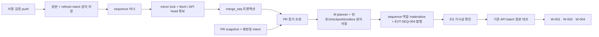

# WP-074 스쿼시 기반 M 번호 상세 설계

> 상태: review | 버전: v0.1 | 갱신일: 2026-09-11

## 1. 문서 계약과 완료 구분

이 문서는 CR-079 / ADR-023 / FR-SEQ-008 / WP-074의 구현 계약이다. 사용자의 이번 세션 지시는 **설계만 작성**이다. 첨부된 수직 구현 지시서의 실행 항목은 후속 구현 세션의 요구조건으로 해석한다. 설계 작성으로 코드·migration·도구·통합 시험·이미지·PR·병합·릴리스가 완료됐다고 보고하지 않는다. 후속 실행은 사용자가 별도로 지시한다.

제품 범위는 `../10_requirements/srs_final.md` FR-SEQ-008이, 외부 HTTP 계약은 `pr_search_api_contracts.md` API-SEQ-007이 소유한다. 이 문서는 내부 상태·필드·알고리즘·복구를 소유한다. `../40_delivery/pr_search_wp074_execution.md`는 파일별 작업과 시험을, `../40_delivery/pr_search_wp074_measurement_guide.md`는 측정 CLI를 소유한다. 상충 시 상위 계약을 고치기 전 구현으로 해석을 고정하지 않는다.

확정 사실: 사내 PR 머지는 squash-only, pilot.4 사내 재시험 결과는 아직 없음, 그 결과는 외부 개발의 착수 조건이 아님. 운영 지연은 사용자가 사내에서 잴 수 있음. WP-075의 제목 쓰기·App 활성화, PIPE DB, PR 본문, 관계 그래프 활성화, OIDC 변경, UI 전면 개편은 제외한다. 공용 upstream의 PR 병합 정책은 사내 squash-only와 별개다.

## 2. 조사 근거와 설계의 한계

2026-09-11 `git fetch origin` 후 시작 HEAD와 origin/main은 `f53d28c4e3fc7e0a4b5ac189da571df05df1741f`, pilot.4는 `a198e12915e6795dc44e1a947073b683e9e5e47b`다. 제품 소스 차이는 없고 마지막 커밋은 handoff 갱신이다. 다음 표는 코드 읽기 결과이며 런타임 재현 결과가 아니다.

| 실제 source | 관찰 | 설계 영향 |
| --- | --- | --- |
| `apps/ingest-gateway/src/store.ts` / `ingest.ts` / `server.ts` | 원본 저장 트랜잭션 뒤 별도 `sequence.requested` 발행; 실패해도 202 | 마지막 push 복구용 intent를 원본과 원자적으로 저장 |
| `apps/pipeline-worker/src/outbox-relay.ts` | `prs:ingest`만 재발행, 10분 경과 + 5분 스캔 | 채번/M 이벤트 outbox라고 재사용 이름만 붙일 수 없음 |
| `apps/pipeline-worker/src/mirror-runner.ts` | `syncByTarget` 호출부 없음; false가 skip와 실패를 합침 | 구조화된 결과 및 sequence 역할의 선행 갱신 |
| `packages/github/src/mirror-sync.ts` | clone/fetch는 존재하나 프로세스 간 동기화 락 없음 | mirror·release·sequence의 모든 sync 호출에 동일 락 |
| `packages/github/src/mirror-graph.ts` / `commit-graph.ts` | head는 rev-parse; 읽기 예외에만 폴백 | 낡은 미러의 성공을 최신성 근거로 쓰지 않음 |
| `apps/pipeline-worker/src/sequence.ts` | PR 후보를 ES에서 읽음; PostgreSQL이 먼저이고 이후 투영·발행 | 기존 PR 필드를 M 확정 근거로 승격하지 않음 |
| `packages/db/src/repositories/pr-snapshot.ts` / `apps/pipeline-worker/src/snapshot.ts` | 버전 조건부 PR document 저장; 확정 증서 없음 | snapshot 쓰기와 재판정 intent를 같은 트랜잭션에 연결 |
| `packages/github/src/client.ts` | PR 목록의 잘못된 응답을 빈 배열로 바꾸는 기존 분기 존재 | M 증거 조회에서는 엄격한 응답·페이지 완료 판정 추가 |
| `packages/es/src/sequence.ts` / `apps/pipeline-worker/src/reindex.ts` | 시퀀스 전용 투영 및 재구축 경로 있음 | 같은 field-owner·dualWrite·reindex fence 재사용 |
| `deploy/single-host/compose.yml` | sequence 역할에 GHE 설정과 RW mirror volume 있음 | 선행 fetch를 sequence에서 실행하는 최소 변경 가능 |
| `deploy/k8s/pipeline-worker-sequence.yaml` | sequence 파드에 mirror volume 없음 | Profile B는 명시적 API 그래프 모드로 설계, 로컬 캐시 존재를 가정하지 않음 |
| `packages/db/migrations/` | 마지막 파일 024_export | 구현 시 다시 확인 후 025 사용 |
| `apps/`, `packages/`의 M 필드/경로 검색 | M 번호 구현·소비자 없음 | API-SEQ-007은 배포 전 계약 정정; 구현 착수 때 재검색 |

### 2.1 공식 외부 계약

확인일 2026-09-11. [커밋의 연결 PR 조회](https://docs.github.com/en/rest/commits/commits#list-pull-requests-associated-with-a-commit)는 커밋의 PR 후보 조회와 읽기 권한을 설명한다. 기본 브랜치 포함 여부에 따라 후보 종류가 달라지므로 응답을 곧바로 확정 매핑으로 쓰지 않는다. [PR 상세](https://docs.github.com/en/rest/pulls/pulls#get-a-pull-request)의 merged 정보와 merge commit 값을 공간·SHA와 대조한다. [페이지네이션](https://docs.github.com/en/rest/using-the-rest-api/using-pagination-in-the-rest-api)의 Link를 따라 전체 후보를 읽는다.

**설계 추론:** 이 자료들은 음성 결과의 영구성, PR 목록의 원자적 스냅숏, PR 인덱싱 완료 장벽을 보장하지 않는다. 조회가 두 번 비어도 부재 확정 증명이 아니다. 사내 GHES 버전과 사용 가능한 API를 실측하지 않았다. Cloud 문서의 버전 헤더를 사내에 그대로 강제하지 않고 기존 transport 버전 정책과 호스트 지원을 검사한다.

### 2.2 직접 푸시 확정의 잔여 조건 — DEV-581

다음 사실을 숨기지 않는다: 현재 소스·공식 계약만으로 **일반 커밋의 PR 부재를 영구 확정하는 production 판정기를 만들 근거를 확보하지 못했다.** 이 설계에서 production 판정기는 양성 PR 증거를 확정할 수 있지만 반복 빈 조회를 `direct_confirmed`로 승격하지 않는다. `negative_evidence_unavailable`로 대기한다. root/init 커밋도 일괄 제외하지 않는다. 그 결과 첫 미확정 항목 뒤의 모든 PR이 대기할 수 있다.

`direct_confirmed`가 요구하는 증서는 `(repository_id, base_branch, epoch, commit_sha)`에 대해 해당 반영이 PR 머지가 아님을 권위 있는 이력 소스가 확정하고, 조회 범위의 완료와 이후 늦은 PR 정보에도 결론이 바뀌지 않음을 보장해야 한다. 권한 제한·인덱스 지연·열거 절단이 없다는 근거도 필요하다. 현재 그런 GHE endpoint 또는 로컬 증서는 없다. 이를 제공하는 척하는 운영 설정, fixture 업로드, 수동 확정 API는 만들지 않는다.

후속 에이전트는 이 조건을 기술 조사로 닫을 수 있다. 대상 GHES의 공식 계약 또는 사내 승인된 증거 소스를 확보하면 CR-079에 근거와 판정 규칙을 보완한다. 단순 실험에서 빈 결과가 안정적이었다는 것만으로 보장으로 승격하지 않는다. 다른 대안인 초기 baseline 건너뛰기·번호 재배치·시간 기반 확정은 사용자 승인 범위를 변경하므로 자동 선택하지 않는다. 이 조건은 설계 작성/외부 테스트 구현의 차단 조건은 아니나 **일반 이력의 M 채번 가용성과 WP-074 전체 완료 판정의 차단 조건**이다. 독립 fixture로 direct 분기를 시험해도 이 조건이 해결된 것은 아니다.

## 3. 불변식과 판정 값

공간 키는 `(repository_id, base_branch)`, 번호 세대는 `seq_epoch`, 정본 행 키는 이 셋과 `merge_seq`다. `merge_number`는 1부터 PR만 세며 `merge_seq`·PR 번호를 대체하지 않는다.

| 내부 상태 | 성립 조건 | planner 동작 |
| --- | --- | --- |
| `pr_confirmed` | merged=true, base.repo.id·base.ref·merge_commit_sha 일치, 증거 버전과 SHA 고정, squash profile 적합 | PR당 한 번호 부여 |
| `direct_confirmed` | 2.2의 완결 증서 검증 성공 | 번호 소비 없이 checkpoint 이동 |
| `unresolved` | 조회 전·부분 응답·빈 결과·불일치·profile 불명 | 그 앞에서 중단 |

별도의 `conflict` 공간 차단 사유는 확정된 PR 변경·확정 direct에 후발 PR 출현·동일 PR 이중 squash SHA·profile 모순이다. 기존 번호는 유지하고 새 부여는 중단한다. 기존 DEV-207의 교정 가능한 `commit.role=direct_push`는 위 상태와 독립이며 M 판단 입력으로 쓰지 않는다.

사내 squash-only는 적용 프로파일이다. 현재 repository 설정만으로 과거 모든 이력의 merge 방식을 증명하지 않는다. 2-parent 이상 커밋은 `unsupported_merge_profile`, rebase로 알려진 입력도 동일 사유다. 부모가 하나라는 사실은 PR/direct 증거가 아니다. PR당 squash SHA가 정확히 하나인지 확인한다. 과거 방식이 증명되지 않으면 `profile_unverified`다. 기존 merge_seq의 merge/squash/rebase 지원과 테스트는 유지한다.

## 4. 실행 구조와 대안 선택

선택: **sequence 역할의 선행 freshness 단계 + PostgreSQL의 고정 용도 durable work + 기존 EventBus 힌트**. 새로운 범용 워크플로 엔진은 만들지 않는다. 내부 함수가 아닌 배포된 러너가 DB의 미완료 work를 기동 직후 및 매초 읽는다.

| 대안 | 결과 |
| --- | --- |
| push 수신에서 fetch | 수신 300ms 예산과 격리 위반으로 기각 |
| mirror/sequence 독립 구독 | fetch 완료보다 채번이 앞설 수 있어 기각 |
| mirror 완료 이벤트만으로 연결 | 완료 이벤트 영속화·다중 역할·볼륨 주소가 추가돼 비용 증가 |
| sequence에서 await freshness 후 assign | Profile A의 기존 RW volume·read App을 이용, 실패와 재시도 경계를 직접 표현하므로 선택 |

### 4.1 freshness 절차

1. 짧은 DB 조회로 등록 활성·대상 브랜치·mirror_enabled 확인. 미등록/해제/비대상은 `skipped` 사유로 work 완료, 일시 장애와 구분한다.
2. mirror 경로이면 **repo 단위 세션 advisory lock** `mirror-sync:<repository_id>`를 전용 pool connection에서 비차단 획득한다. 기존 세션 락의 connection 수명/해제 관례를 재사용하되 획득은 신규 `tryMirrorSessionLock`의 `pg_try_advisory_lock(hashtext($1))`을 쓴다. 기존 `acquireAdvisorySessionLock`은 blocking이므로 그대로 호출하지 않는다. SQL BEGIN 없이 fetch를 감싼다. 락 경합은 5초 defer다. 모든 `MirrorSync.sync` 호출자(sequence, mirror sweeper, release)를 이 wrapper로 통일한다. 하위 라이브러리 `@prs/github`에 DB 의존을 추가하지 않는다.
3. 성공한 fetch 후 `observed_head`와 완료시각을 기록한다. fetch 실패이면 `retryable_failure`, token/권한 실패는 명시적 사유로 재시도 대기. 낡은 미러로 정상 채번을 하지 않으며 이번 설계는 fetch 실패 시 API로 자동 전환하지 않는다.
4. Profile A는 같은 `mirror-data` 볼륨의 같은 repo 디렉터리를 쓴다. Profile B는 sequence를 API mode로 명시하며 mirror 기반 freshness를 주장하지 않는다. API는 `resolveHead`를 fresh 요청으로 다시 읽고 전체 first-parent 구간을 그 SHA에 고정한다. API 장애/부분 조회도 retry다. mirror 미사용 저장소도 이 경로다.
5. 기존 assign 트랜잭션은 공간 락 이후 repo 설정·epoch·기존 head를 다시 확인한다. 준비한 graph head와 현재 로컬 head가 달라졌으면 쓰기 전 rollback하고 새 freshness 회차를 수행한다. fetch와 새 PR 조회는 이 트랜잭션 안에 넣지 않는다. 저장 head가 바뀌면 기존 재작성 감지·repair 경로로 전환한다.
6. mirror 락은 freshness와 필요한 git read가 끝날 때까지 유지하고 M 증거 API 호출 전에 해제한다. lock 순서는 mirror → seq xact이며 반대 순서의 fetch를 금지한다. 세션 락을 못 푼 connection은 pool에 반환하지 않고 폐기한다.
7. push의 head는 순서를 정하는 값이 아니라 work dedupe 및 측정 출처다. 중복·역순 push 모두 최신 원격 head를 다시 읽는다. 새 push가 fetch 중 도착하면 durable intent가 따로 남으므로 다음 회차가 처리한다. 브랜치 삭제는 `no_branch`이며 기존 번호를 삭제하지 않는다.

`FreshnessOutcome`은 `ready{mode, observedHead, completedAt}` / `skipped{reason}` / `no_branch` / `defer{retryAt,reason}` / `failed{reason,retryAt}`의 discriminated union이다. boolean `syncOne`을 M 호출 경로에 노출하지 않는다. 기존 sweeper의 집계는 결과 union을 변환한다.

### 4.2 실제 호출 지점과 완료 경계

`prepareAndAssignSequence`를 worker의 freshness 진입 함수로 고정한다. durable refresh 러너, 기존 handleSequenceEvent, 수동 sequence-assign-runner, 조정 스캔이 만드는 요청은 모두 이 진입을 거친다. 새 GHE I/O는 seq transaction 밖이다. assign의 DB commit에는 reconcile work가 같은 transaction으로 남아야 한다. 자동/수동 재채번의 새 epoch commit도 같은 의도를 만든다. append 결과가 0건이어도 미완료 M work를 지우지 않는다.

mirror 락과 legacy assign은 freshness/first-parent 입력 읽기 → seq xact commit/rollback → mirror 락 해제 → 기존 ES·EVT-SEQ-001/002 후처리 순서다. 후처리를 제거하는 것이 아니라 위치를 명시한다. prepare에서 읽은 head·epoch·chain은 transaction에서 검증하고 불일치 시 재준비한다. API mode도 준비된 head SHA에 고정된 chain을 사용한다. 기존 seq 후처리 실패에도 durable retry가 남게 한다.

refresh work 완료는 seq commit과 reconcile 영속 예약 이후다. 기존 stale outcome을 durable runner가 성공 ack하면 안 된다. archived/not_sequence_branch/no_branch는 별도 사유로 정상 종료하며 이후 새 push는 새 work다. 최소 한 번 실행이고 번호 멱등성이 중복을 안전하게 한다.

배포 키 `SEQUENCE_GRAPH_MODE=api|mirror`를 추가해 Profile A 기본 mirror, B api로 전달한다. 이는 현재 코드에 없는 후속 구현 키다. mirror mode의 storage/credential이 없으면 기동 검증에서 거부하고 조용히 API로 바꾸지 않는다. repository.mirror_enabled=false는 어느 배포에서도 API 경로다. 적용 전 기존 채번 API fallback 회귀와 선택 조건을 시험한다.

## 5. PR 증거 수집과 재개

### 5.1 양성 증거 알고리즘

1. 해당 first-parent 행과 PostgreSQL snapshot을 repo·branch·merge SHA로 조회한다. existing `pull_request_number`는 후보 힌트일 뿐이며 다른 공간의 번호를 답하지 않는다.
2. snapshot의 `state=merged`는 현재 투영이 만든 상태다. 원본 `merged` boolean과 base.repo.id를 잃은 snapshot이면 authoritative PR 상세를 읽어 `merged=true`, `merged_at != null`, `base.repo.id`, `base.ref`, `merge_commit_sha`를 직접 확인한다. 신규 typed `getPullRequestEvidence`는 필요한 필드를 보존한다.
3. 후보가 없으면 `GET /repos/{owner}/{repo}/commits/{sha}/pulls?per_page=100`을 Link의 next가 없어질 때까지 읽고 모든 후보의 PR 상세를 확인한다. 최대 100페이지/회차; 상한에 닿으면 `partial_lookup`이며 재개 cursor를 저장한다. 절대로 기본 브랜치를 대신 대입하지 않는다.
4. 보정 조회는 `GET /repos/{owner}/{repo}/pulls?state=all&sort=created&direction=asc&per_page=100`을 사용한다. branch/state로 미리 걸러서 이동 중인 PR을 잃지 않고 상세에서 조건을 확인한다. 기존 클라이언트의 non-array→[] 처리와 hasMore 추정은 증거 경로에 사용하지 않는다. 새 strict 메서드는 HTTP 상태·Link·schema 유효성을 반환한다. 새 메서드는 기존 호출부 의미를 바꾸지 않는다.
5. 정상 전체 열거는 `scan_complete`라는 조회 사실만 기록한다. head가 이동하거나 중복/페이지 내용이 어긋나면 재시작한다. 완전 열거 두 회와 snapshot 재대조도 **후보 발견용**이며 음성 확정이 아니다. 후보가 계속 없으면 2.2 규칙을 적용한다.
6. 일치 후보 1개면 `pr_confirmed`. 2개 이상이면 `mapping_conflict`. 실패·부분·권한 부족이면 unresolved. 후보 제목·원본 SHA·head_sha를 증거로 사용하지 않는다.

### 5.2 정보 도착 시 새 push 없이 재개

PR snapshot 쓰기 트랜잭션에 `sequence_work(kind=reconcile)` upsert를 포함한다. `snapshot.ts`의 실시간/백필/조정/부트스트랩 호출 모두 같은 repository primitive를 사용한다. stale 버전이 무시되면 새 payload로 증거를 덮지 않는다. 동일 버전 재실행은 같은 generation에 수렴한다.

이 intent는 `(repo, base)`에만 합쳐지며 `requested_generation`을 증가시킨다. 실행 중 추가된 generation을 완료로 덮지 않도록 완료 UPDATE는 claim 시 generation과 lease token으로 CAS한다. 예전 base에서 새 base로 바뀌면 두 공간을 깨운다. 새로운 PR snapshot 저장이 성공했는데 ES가 실패하더라도 DB work로 재개한다. 삭제/상태 불일치 발견 시 이전 확정 번호는 지우지 않고 conflict로 멈춘다.

기존 EVT-SEQ-001/002도 reconcile을 요청한다. event 수신 때 hint만 있고 아직 work가 없으면 idempotent로 만든다. 전용 논리 구독 그룹을 등록하고 `prs:projected`의 link 또는 commit-enrich와 나눠 먹지 않는다. 기동/매초 durable poll이 정상 재개 경로이고 일일 04:30 KST 스윕은 누락 상태를 찾는 보조 검사다.

구독 이름은 `LOGICAL_CONSUMERS[TOPICS.projected]`의 신규 `mnumber`, `consumerGroup(TOPICS.projected, 'mnumber')`(현 규칙에서 link:mnumber)다. 핸들러는 sequence.assigned의 seq_epoch, sequence.reassigned의 new_epoch 및 ingestion.projected의 PR 신호만 처리한다. mnumber.assigned는 무시하여 자체 발행 루프를 금지한다. 중복 신호로 추가 read 회차가 생겨도 확정된 번호/announce 구간은 다시 생성하지 않는다. 발행 전 crash는 이 구독이 아니라 DB transaction의 work가 복구한다.

## 6. migration과 영속 데이터 사전

아래는 **목표 스키마**다. 실제 SQL 파일은 후속 구현에서 만든다. migration 025가 비어 있을 때만 `025_merge_number`를 사용한다. SRS의 정본 번호는 여전히 `merge_sequence`; 추가 표는 증거·전달·측정의 수명만 담당한다. 전체 과거 데이터 채움·원격 API·git 명령은 migration에서 금지한다.

### 6.1 기존 표 확장

| 표 / 열 | 타입·초기값 | 의미 / 제약 |
| --- | --- | --- |
| merge_sequence.merge_number | BIGINT NULL | 1..9007199254740991; 내부 bigint, 경계 밖 채번은 `number_capacity_exceeded` |
| merge_sequence.annotate_state / annotated_at | TEXT NULL / TIMESTAMPTZ NULL | WP-075 예약; WP-074는 항상 NULL |
| merge_sequence.mnumber_assigned_at | TIMESTAMPTZ NULL | DB clock_timestamp(), 기존 assigned_at과 분리 |
| sequence_space.mnumber_head_seq / mnumber_head | BIGINT NOT NULL DEFAULT 0 | 확인 완료 merge_seq / 마지막 M 번호 |
| sequence_space.mnumber_blocked_seq | BIGINT NULL | checkpoint 다음 미확정/충돌 행 |
| sequence_space.mnumber_blocked_reason | TEXT NULL | 3·8절 고정 reason enum; 임의 예외 문구 아님 |
| sequence_space.mnumber_blocked_since | TIMESTAMPTZ NULL | 같은 blocker이면 보존, 해소 때 NULL |

필수 constraints: `merge_number > 0` 및 safe bound, `merge_number IS NULL OR pull_request_number IS NOT NULL`, `(repo,base,epoch,merge_number) WHERE merge_number IS NOT NULL` unique, `(repo,base,epoch,pull_request_number) WHERE merge_number IS NOT NULL` unique. checkpoint는 비음수이며 `mnumber_head <= mnumber_head_seq <= head_seq`. annotate 값의 허용 집합은 기존 설계 `done|mismatch|failed|disabled|NULL`을 유지한다. M 번호 없는 annotate 상태는 거부한다.

### 6.2 ENT-SEQ-005 `mnumber_evidence`

PK/FK는 `merge_sequence`의 `(repository_id,base_branch,seq_epoch,merge_seq)`이고 ON DELETE RESTRICT. 행이 없으면 unresolved로 해석한다. **기존 NULL과 기존 PR 연결을 migration에서 확정하지 않는다.**

| 열 | 타입 / 값 |
| --- | --- |
| commit_sha | TEXT NOT NULL, 부모 행 SHA와 transaction에서 일치 확인 |
| state | TEXT NOT NULL, unresolved / pr_confirmed / direct_confirmed |
| pr_number | INT NULL, pr_confirmed에서만 NOT NULL |
| reason | TEXT NULL, unresolved는 사유 필수 |
| evidence_version | BIGINT NOT NULL DEFAULT 1, CAS 단조 증가 |
| source_kind | TEXT NOT NULL, pr_detail / verified_snapshot / unresolved_lookup / authoritative_absence |
| source_pr_version | BIGINT NULL, snapshot document_version 또는 상세 updated_at 변환값 |
| merged_at | TIMESTAMPTZ NULL, pr_confirmed에서 필수 |
| checked_at / first_pending_at | TIMESTAMPTZ NOT NULL / TIMESTAMPTZ NULL |
| proof | JSONB NOT NULL, 허용 필드 아래 참조 |

proof 허용 필드: `schema_version=1`, `profile=squash_only`, `matched_repository_id`, `matched_base_branch`, `matched_merge_commit_sha`, `merged`, `page_count`, `lookup_complete`, `scan_started_at`, `scan_finished_at`, `observed_head`, `source_request_id_hash`. 제목·본문·작성자·raw payload·URL·token은 금지. `authoritative_absence`는 2.2 근거가 닫히기 전 production에서 생성 금지. fixture 소스는 production 입력 enum에 추가하지 않는다. integration DB에서만 독립 생성한 증거를 직접 주입한다.

확정 후 다른 증거가 오면 번호 변경 대신 공간 blocker를 `mapping_conflict`로 기록한다. conflict는 원인 조사가 가능한 safe evidence digest를 로그에 남긴다. 데이터 수정으로 해결하는 관리 API는 이번 범위에 없다. unresolved→확정과 동일 증거 재검증만 정상 전이다.

### 6.3 ENT-SEQ-006 `sequence_work`

M 경로에 한정된 durable inbox/outbox다. existing job claim/lease·EventBus·defer helper를 재사용하되 raw_event의 processed_at에 다른 소비자의 완료를 겹쳐 쓰지 않는다.

| 열 | 타입 / 뜻 |
| --- | --- |
| work_key | TEXT PRIMARY KEY, 아래 결정론적 키 |
| kind | TEXT NOT NULL, refresh / reconcile / materialize / announce |
| repository_id / base_branch | BIGINT NOT NULL / TEXT NOT NULL |
| seq_epoch | INT NULL, refresh만 NULL 허용; reconcile은 현재 epoch로 생성 |
| requested_generation / completed_generation | BIGINT DEFAULT 1 / 0 |
| payload | JSONB bounded 64KiB, 아래 kind별 허용 항목 |
| state | TEXT, ready / leased / retry / parked / done / obsolete |
| available_at / lease_until | TIMESTAMPTZ NOT NULL / NULL |
| lease_token | UUID NULL, claim마다 신규 |
| attempt_count / last_reason | INT DEFAULT 0 / TEXT NULL |
| created_at / updated_at | TIMESTAMPTZ NOT NULL |

키/본문: refresh=`push:<delivery_id>` (`delivery_id,received_at,head_sha,correlation_id`); reconcile=`reconcile:<repo>:<branch>:<epoch>` (`trigger_kind`만, source event의 임의 구간 신뢰 금지); materialize=`materialize:<repo>:<branch>:<epoch>:<pr>` (`pr_number`); announce=`announce:<repo>:<branch>:<epoch>:<from>:<to>` (`EVT-SEQ-004` payload). branch의 구분문자는 length-prefix 또는 JSON tuple 직렬화로 처리한다. 단순 ':' 합치기로 충돌하지 않게 한다. 위 표기는 읽기용 shorthand다.

refresh는 raw_event insert와 같은 transaction에 저장한다. 번호 부여/checkpoint와 materialize·announce 생성은 같은 transaction이다. snapshot update와 reconcile generation 증가도 같은 transaction이다. 외부 I/O 성공과 DB ack 사이 crash는 같은 work를 다시 실행하며 소비자는 멱등이다.

ready/retry due index `(available_at,work_key)` partial WHERE state IN ('ready','retry'); 만료 lease index `(lease_until)` WHERE state='leased'. claim은 `FOR UPDATE SKIP LOCKED LIMIT 100`의 짧은 transaction, lease 60초·heartbeat 10초. 모든 finish는 lease_token와 generation 조건을 검사한다. 실패한 worker의 늦은 ack는 0행 갱신이어야 한다. retry 1,2,4,8,16초 이후 60초 cap(±20% jitter), rate limit은 Retry-After/reset 우선. 5회 실패하면 경보하되 work를 없애지 않는다. 권한/기능 unsupported는 parked; 5분 간격 제한 재검사와 설정 재로딩 후 즉시 깨움. 락 경합은 attempt 실패로 세지 않고 5초 defer. pending evidence는 60초 간격, snapshot 도착은 available_at을 now로 앞당긴다.

done refresh/announce work는 기본 30일 뒤 bounded cleanup(1회 1000행)하고 미완료·parked work는 삭제하지 않는다. materialize/reconcile 키는 살아 있는 공간/PR당 한 행으로 generation을 갱신한다. tombstone은 에폭과 함께 유지해 옛 이벤트를 분류한다. retention은 이번 운영 메타데이터만 대상이며 raw_event·audit 보존 계약은 유지한다.

기본값: state=ready, available_at=DB now, lease_until/token=NULL, last_reason=NULL, created_at/updated_at=clock_timestamp(). completed_generation≤requested_generation, generation 비음수; leased일 때 lease 필드 둘 다 필수, 나머지 state에서 NULL을 강제한다. poll은 한 루프에서 슬롯 최대 8, 같은 공간 M 회차는 1개다. claim 100은 버퍼 상한이지 동시 I/O 수가 아니다. realtime refresh/reconcile 우선이며 8회 중 최소 1회는 due backfill에 할당한다. 긴 API 열거는 최대 100페이지 후 cursor 저장으로 양보한다.

batch 역할의 신규 고정 함수 cleanupSequenceMetadataOnce가 기동 후 및 매시간 1000행씩 정리한다. sample.created_at 또는 완료 work.updated_at이 30일 전인 행만 대상이며 활성 evidence/번호/미완료 work는 제외한다. sample에는 created_at TIMESTAMPTZ NOT NULL DEFAULT clock_timestamp()를 추가한다. SQL 실패는 다음 회차 retry/metric으로 처리하고 startup 실패로 전파하지 않는다. 기존 보존 잡이나 범용 job API를 확장하지 않는다.

### 6.4 ENT-SEQ-007 `sequence_latency_sample`

PK `sample_id UUID`, unique `(work_key,attempt,seq_epoch,pr_number)`; work_key는 TEXT 참조값이며 work cleanup에 cascade하지 않는다. `repository_id BIGINT`, `base_branch TEXT`, `seq_epoch INT`, `pr_number INT NULL`, `delivery_id TEXT NULL`, `trigger_kind TEXT(new_squash|backfill|retry|reassign|reconcile)`, `outcome TEXT(pending|failed|assigned|visible|skipped)`.

시각 열은 모두 TIMESTAMPTZ nullable: `received_at`, `attempt_started_at`, `mirror_completed_at`, `sequence_assigned_at`, `mnumber_assigned_at`, `search_observed_at`. 그 외 `reason TEXT NULL`, `search_poll_interval_ms INT`, `observed_index_uuid TEXT NULL`. 측정 시작 원본을 상관 ID만으로 추정하지 않는다. 번호가 붙은 각 PR에 최초 실제 merge push의 delivery 연결이 증명되지 않으면 received_at을 NULL로 남긴다. 일괄 fetch로 들어온 옛 PR의 수신시각을 마지막 push 시각으로 채우지 않는다.

수신시각은 원본 raw_event 값, 다른 stage 시각은 수행 사실 뒤 DB clock_timestamp()로 기록한다. 가능하면 동일 DB clock을 사용하되 기존 raw_event.received_at의 앱 clock 차이는 출력에서 드러낸다. ES bulk ACK는 가시성 시각이 아니다. 별도 `_search`/실제 검색 API에서 같은 epoch·M 값 확인 후 관측시각을 남긴다. sampled observer는 sequence 역할이 읽기 작업으로 실행하며 실패는 work/번호 성공을 rollback하지 않는다. 별도 best-effort transaction 실패는 `measurement_missing` counter만 증가시킨다.

샘플은 30일 보존, `(repository_id,base_branch,received_at)`와 `(outcome,attempt_started_at)` index. 보존 삭제는 batch 역할의 bounded 운영 메타데이터 cleanup으로 수행하고 audit/raw_event 파티션 잡을 확장하지 않는다. 등록 저장소 식별자는 내부 운영 데이터이며 외부 보고에는 hash로 치환한다. 새 표·sequence에는 명시적 `prs_app` CRUD 및 필요한 sequence USAGE를 migration에서 부여한다. 전용 측정 role은 이 표와 한정 view SELECT만 받는다.

## 7. 순수 planner·트랜잭션·에폭

계측의 추가 구분: API는 DB 값을 보완하므로 응답의 M 숫자만 보고 ES 가시성을 판정하지 않는다. 자동 observer는 실제 ES `_search` hit의 merge_number/merge_number_epoch/repository_id/base_branch/merge_commit_sha와 DB 기대값을 대조한다. 기존 API DTO에는 `merge_number_projection_state: in_sync|pending|unknown`을 추가하여 **실제 ES hit 값이 대조된 사실**만 알린다. DB로 보완됐으나 ES hit가 오래됐으면 pending, ES hit 자체를 확인할 수 없으면 unknown이다. watch는 assigned 및 projection_state=in_sync일 때만 mnumber_to_search_observed를 완료한다. UI의 M 배지에는 이 운영 필드를 직접 노출하지 않는다. ES의 실시간 GET이나 DB 조회만으로 이 플래그를 in_sync로 만들지 않는다. T06c는 ES 번호를 의도적으로 늦춘 상황에서 API의 번호는 보이지만 watch는 대기하는 것을 검증한다.

observer 재시작 복구는 sample.search_observed_at IS NULL인 현재 epoch assigned 표본을 기동 시/2초마다 최대 100건 읽는 고정 루프다. 1회 `_msearch`로 묶고 요청 중복을 막는다. 120초 후 timeout 사유를 기록하고 더 느린 60초 retry로 전환한다. timeout을 0ms로 저장하지 않는다. 성공 관측은 최초 값만 COALESCE로 채우고 이후 관측으로 덮지 않는다. 같은 표본의 `last_search_absent_at TIMESTAMPTZ NULL`·`observation_attempts INT DEFAULT 0`도 저장하여 관측 구간을 복원한다. sample unique는 PostgreSQL 16의 NULLS NOT DISTINCT로 unknown PR/epoch 표본도 같은 attempt에서 중복 생성되지 않게 한다.

함수는 `apps/pipeline-worker/src/mnumber-plan.ts`의 `planMergeNumbers`로 고정한다. 기존 sequence-plan.ts의 numberCommits와 책임을 나누되 같은 순수 판정 계층이다. 입력: `space{repo,base,epoch}`, `checkpoint{headSeq,headNumber}`, 정렬된 연속 `rows{mergeSeq,sha,decision,prNumber,evidenceVersion,existingNumber,mergedAt}`, `previousAssignedPr`(회차 경계 대조용). 내부 서수는 bigint, 시각은 ISO/epoch millis로 검증 후 비교한다.

입력 순서 오류/누락/다른 공간/중복 seq는 오류다. 입력을 정렬해서 숨기지 않는다. 첫 row가 checkpoint+1이어야 한다. batch 기본 100, 상한 1000, 한 회차 최대 1초의 planner/DB 처리 예산(외부 I/O 제외). 예산 소진은 완료가 아니라 즉시 다음 work 회차다.

PR 확정이면 이미 부여된 PR 집합과 비교한다. 같은 PR·SHA·번호 재처리는 no-op이고 다른 seq에 같은 PR이 오면 conflict다. checkpoint를 넘어 기존 번호가 발견되면 정본 불일치로 중단한다. direct 확정은 seq만 증가. unresolved는 그 앞에서 멈춘다. 결과는 `assignments`, `nextHeadSeq`, `nextHeadNumber`, `blocked`, `orderMismatches`다. 빈 결과도 blocker를 반환할 수 있다.

예: 기존 headSeq=0/headNumber=0, 입력 seq1=PR#21, seq2=확정 direct, seq3=PR#25, seq4=unresolved, seq5=PR#29 → M1=#21/M2=#25, checkpoint=3/2, blocked=4. seq4가 PR#27로 확정되면 다음 회차 M3=#27/M4=#29. seq4가 증서 있는 direct면 M3=#29. 어느 경우에도 앞 번호를 옮기지 않는다. 이 예의 direct 증서는 **독립 fixture**이며 production 부재 판정의 증명이 아니다.

M transaction: BEGIN → 기존 seq 공간 advisory xact lock → repo/epoch/checkpoint/evidence_version 재검증 → batch 읽기 → planner → row 번호 및 mnumber_assigned_at → checkpoint·blocker → materialize/announce work → COMMIT. 외부 GHE/ES/Redis 호출은 없다. 충돌 검출 시 해당 번호 쓰기 transaction을 rollback하고 별도 짧은 transaction에서 현재 generation에 blocker를 남긴다. 기존 `upsertMergeSequence`의 COALESCE는 legacy 매핑에는 유지 가능하지만 M 확정 경로는 서로 다른 non-null PR을 explicit error로 거부한다.

`merged_at` 대조는 직전 번호가 있는 PR부터 시작해 이번 batch 내 연속 PR 쌍을 비교한다. 후행 시각 < 선행 시각이면 mismatch, 동률은 mismatch 아님. NULL은 missing 지표이며 번호를 막지 않는다(유효 PR 상세는 merged_at을 요구하므로 NULL은 legacy 자료 검증 경로에 한정). 관측 실패가 번호 트랜잭션을 실패시키지 않게 metric emit은 commit 뒤다.

에폭 변경의 `bumpEpoch`에서 M checkpoint=0, blocker=NULL로 초기화한다. `copySequencesUpTo`는 기존 seq/SHA/PR을 복사하되 M 번호·annotate·증거 확정·M 시각은 복사하지 않는다. 새 증거는 새 epoch/chain에서 재검증한다. 이전 epoch 행은 보존한다. 새 epoch 시작 시 모든 해당 PR에 materialize invalidation work를 원자 생성하거나 bounded epoch repair generation으로 예약한다. old reconcile/announce work는 현재 epoch 대조 후 obsolete; old materialize는 현재 DB 값을 다시 읽어 삭제/최신값 적용에 수렴시킨다. payload의 옛 M 값을 쓰지 않는다.

## 8. DB → 이벤트 → ES → API의 수렴

EVT-SEQ-004 payload: `{repository_id,base_branch,seq_epoch,from_mnumber,to_mnumber,pull_request_numbers[]}`. range는 양끝 포함, 숫자는 safe integer, PR 배열은 오름차순 M 순서이며 최대 1000건. 이벤트 ID는 announce work_key로 결정론 생성한다. DB bigint→이벤트 number는 상한 검증 뒤에만 변환한다.

이 이벤트는 `prs:projected`에 발행하되 기존 link/commit-enrich는 이름 필터로 무시하는 시험이 필요하다. **WP-074 ES 반영은 이벤트 전달만 의존하지 않고 sequence 역할의 materialize work가 소유**한다. WP-075는 향후 전용 논리 그룹을 추가한다. 지금 annotate consumer/App은 만들지 않는다. emit 성공 후 ack 실패는 중복 이벤트이며 번호를 다시 계산할 이유가 아니다. announce가 실패해도 materialize는 독립적으로 수행한다.

ES owner 필드: `merge_number:long`, `merge_number_epoch:integer`, `merge_number_state:keyword`, `merge_number_reason:keyword`. 표현 문자열은 저장하지 않고 API가 현재 저장소 이름으로 만든다. `merge_number_epoch`는 기존 문서 seq_epoch와 갱신 순서가 다를 수 있어 별도로 두며 두 epoch 일치 시에만 표시한다.

materializer는 DB의 현재 epoch·증거·번호를 다시 읽는다. `withReindexWrite`/`dualWrite`를 거쳐 active와 shadow 모두에 적용한다. ES script는 document의 repository_id/base_branch/merge_commit_sha가 expected와 같을 때만 쓰고, 더 높은 M epoch가 있으면 옛 쓰기를 거부한다. 일반 upsert의 doc/union/createOnly에 M owner 필드를 넣지 않으며 새 PR 문서에는 미설정으로 생성한다. 일반 PR 저장·ES 생성 이후 materialize generation을 반드시 증가시켜 이벤트가 먼저 왔어도 수렴시킨다.

missing document/partial bulk/version conflict를 성공 처리하지 않는다. `document_missing`은 기존 snapshot 재투영 경로를 요청한 뒤 retry한다. 의도한 active/shadow target 전체의 작업 결과가 성공일 때 해당 generation 완료. shadow가 아직 없는 상황도 재색인 프로토콜의 target 집합으로 판정한다. snapshot→reindex 문서 생성은 같은 M read-model builder를 거치거나 materialize를 스캔 완료 barrier 전에 수행한다. alias 전환 전 새 M 필드의 정본 대조를 필수 게이트로 둔다.

에폭 상승 뒤 old event와 new clear가 경주하면 payload를 쓰지 않고 현재 DB 재조회한다. 더 높은 epoch 삭제는 `merge_number`를 제거하고 state를 pending으로, `merge_number_epoch`를 새 값으로 남긴다. 옛 script가 낮은 epoch면 거부한다. 기존 sequence writer가 문서 seq_epoch를 늦게 바꾸어도 API의 DB 대조가 stale 값을 숨긴다.

기존 검색·상세·범위 API는 페이지에 포함된 PR들만 `(repo,base,pr)` tuple로 묶어 PostgreSQL에 **1회 batch 조회**하여 현재 epoch·M 상태를 덧붙인다. 페이지의 ES 필드가 정본과 다르면 정본 값을 응답하며 stale projection 지표를 남긴다. 기존 ES 필터/커서/정렬/건수는 유지한다. 이는 행별 HTTP 호출을 금지하고 잘못된 epoch 노출을 막기 위한 선택(ADR-023)이다. DB 실패는 M 부분을 `unavailable`로 표시하고 기존 검색 결과를 숨기지 않는다. resolve API는 정본 필수이므로 DB 실패 시 기존 500 INTERNAL_ERROR envelope(접근 범위 조회 자체의 실패만 503 PERMISSION_UNAVAILABLE)다.

## 9. API와 UI의 값 계약

HTTP 요청의 정본은 API-SEQ-007 절이다. `repository`·`base_branch` 필수, `pr_number` XOR `merge_number`, M 방향은 `seq_epoch` 필수. PR 방향만 epoch 생략=현재를 허용한다. 중복 query key·빈 값·잘못된 정수는 400. 코드가 없는/숫자 부분이 여러 개인 저장소 이름은 `repository_code_unavailable`로 표시하며 합치거나 첫 숫자를 고르지 않는다. 유일한 연속 숫자 run을 코드로 쓰고 선행 0을 보존한다.

M 문자열 regex는 `^M-([0-9]+)-([1-9][0-9]*)$`, suffix는 1..9007199254740991. pr_number/epoch는 1..2147483647. 비교·검증은 BigInt 후 range 검증이며 parseInt prefix 허용 금지. DB NUMBER 변환 전 동일 bound 검사. 기존 API merge_seq의 형식(number)은 유지하며 이번 기능이 처리 가능한 상한을 명시한다. 범위를 넘어도 반올림한 M을 내보내지 않는다.

| 상태 | resolve 응답 | 목록/상세/범위 UI |
| --- | --- | --- |
| 확정 | 200 assigned, 표기 M 문자열 및 PR/seq/epoch | PR 번호 옆 M 배지 |
| merge_seq 없음 | 409 NO_SEQUENCE, reason=not_sequenced | `시퀀스 채번 대기` |
| M만 대기 | 200 pending, reason=pr_evidence_pending / predecessor_pending / negative_evidence_unavailable / partial_lookup / profile_unverified / unsupported_merge_profile / mapping_conflict / fetch_failed | `M 번호 대기` + 접근 가능한 사유, 잠정값 없음 |
| 미머지 PR | 409 NO_SEQUENCE, reason=not_merged | `M 번호 대상 아님` |
| 비대상 branch | 409 NO_SEQUENCE, reason=branch_not_tracked | `채번 비대상 브랜치` |
| PR의 base 불일치/없는 PR | 404 NOT_FOUND | 기존 찾을 수 없음 |
| 저장소 미등록/권한 밖 | 같은 404 NOT_FOUND | 기존 권한·404 처리, blocker 식별자 유출 금지 |
| epoch 불일치 | 200 epoch_stale, 결과 식별자 필드 자체 없음 | 기존 무효 배너; M 링크 복사 금지 |
| 알 수 없는 M | 404 NOT_FOUND, 잠정값 조회 금지 | 기존 찾을 수 없음 |
| 표시용 코드 계산 불가 | PR 방향 200, assigned 수치가 있으면 merge_number=null, state=unavailable, reason=repository_code_unavailable | `저장소 코드 확인 필요` |
| 정본 M batch 실패 | resolve는 500 INTERNAL_ERROR; 목록은 M state=unavailable | `M 번호 확인 불가` + 기존 재시도 |

`pending_reason`의 내부 blocker seq는 사용자에게 노출하지 않는다. 운영 CLI만 접근 권한 내에서 blocker seq를 조회한다. `sequence_state=reassigning`의 마지막 확정 값은 같은 read snapshot의 seq_epoch에만 속한다. 트랜잭션 중 새/옛 값을 혼합하지 않도록 API는 REPEATABLE READ read-only transaction 또는 단일 SQL snapshot을 사용한다. 새 epoch가 commit된 뒤에는 옛 숫자를 마지막 값이라 다시 보여주지 않는다.

기존 목록·상세·범위 PR DTO는 `merge_number:string|null`, `merge_number_state:assigned|pending|not_applicable|unavailable`, `merge_number_reason:string|null`, `merge_number_epoch:number|null`을 additive로 갖는다. 응답의 merge_number는 표시 문자열이고 ES의 같은 이름 필드는 정수다. M용 별도 bigint 출력 필드는 만들지 않는다. 직접 commit DTO는 이 필드가 없어도 되고 UI는 영역을 그리지 않는다. `epoch_stale`은 기존 outer response 계약이 우선이며 rows를 보이지 않는다.

실제 렌더 경로: W-001 `SearchView → ResultWorkbench → ResultTable`; W-002 `PrDetailView + lib/pr-detail`; W-004 `RangesView → RangeResultTable + lib/range`. M 표시 모델 하나를 세 경로에서 공유한다. C-014와 Conductor Badge를 소비하고 토큰·CSS 재정의는 하지 않는다. ResultTable의 PR 번호·title link·선택키·키보드 탐색은 그대로다. W-004는 행 병기만 수행하고 anchor/range/bisect의 입력은 merge_seq다.

DTO 필드의 결정 순서를 고정한다. outer epoch_stale이면 M 키를 만들지 않는다. PR이 미머지/비대상이면 not_applicable, number/epoch=NULL, reason=not_merged/branch_not_tracked. M DB batch 실패면 unavailable, number/epoch=NULL, reason=mnumber_read_failed. 해당 시퀀스 공간/행이 없으면 pending, number=NULL, epoch는 확인한 현재 공간 값 또는 NULL, reason=not_sequenced. seq 행이 있고 번호가 없으면 pending/current epoch; 자기 증거 미확정은 pr_evidence_pending, 앞 blocker 때문에 멈췄으면 predecessor_pending이다. 9절 표의 구체적인 자기 실패 사유가 있으면 그 enum으로 치환한다. 번호가 있으면 assigned/current epoch/null reason이며 코드 계산 실패만 unavailable/repository_code_unavailable로 바꾼다. 정수 상한 초과는 unavailable/number_capacity_exceeded다. 내부 예외 메시지를 reason으로 전달하지 않는다. ES projection 상태는 6.4절의 추가 필드로 항상 함께 전달하며 아직 번호가 없거나 ES를 검사하지 못한 때 unknown이다.

M feature off는 검색 API·web server와 sequence/cleanup 역할에 동일 설정을 전달한다. M DTO의 키는 기존 응답에서 생략하며 기존 페이지가 그대로 동작한다. 해당 flags를 확인할 데이터가 없는 구버전 응답도 M off처럼 표시한다. 입력된 M deep link는 정상 로그인 확인 뒤 404 feature_disabled를 표시하고 기존 검색 링크를 제시한다. client에 env 비밀이나 DB URL을 보내지 않고 공개 boolean만 전달한다.

M 배지의 링크는 기존 `/search` 표면에서 `m_repository`, `m_base_branch`, `m_seq_epoch`, `m_number` 네 query key를 받는 좁은 resolver 진입을 사용한다. 키 일부만 있으면 오류를 표시하고 임의 branch/epoch로 메우지 않는다. 클라이언트는 기존 인증된 BFF를 통해 resolve **1회** 수행하고 성공하면 기존 PR 상세 경로로 이동하되 M 문맥과 from_q를 보존한다. 원래 q가 함께 있으면 from_q만으로 저장하고 먼저 M resolve를 수행한다. 이 진입은 일반 질의 문법에 M 토큰을 추가하지 않는다. 복사 링크는 동일 네 키를 URLSearchParams로 직렬화하며 label-only 복사와 명확히 구분한다. pending/unavailable에는 M 링크를 만들지 않는다. 텍스트 링크는 새 탭 열기를 지원한다. 복사 성공/실패는 기존 live region을 사용한다.

자동 갱신은 행별 poll이 아니라 현재 목록/상세 요청 1개를 5초 간격으로 재검증한다(visible document, pending 있는 경우만, in-flight 겹침 금지). 60초 후 자동 poll을 멈추고 수동 새로고침을 제시한다. hidden/unmount/401/epoch_stale에서 중단한다. 커서와 from_q를 그대로 사용하고 stale cursor는 기존 처리를 따른다. 조회 정책과 실제 카운트/키보드 focus 유지 테스트가 필요하다.

## 10. 운영 계측과 배포·rollback

수신→mirror, 수신→merge_seq, 수신→M, M→검색 관측의 표본을 stage별로 구분한다. 기존 NFR-002 수신→검색 p95≤10초/p99≤60초와 비교하되 M 부가 경로에도 같은 **검증 목표**를 사용하고 새 운영 보장으로 표기하지 않는다. 직접 확정 증거 부재로 막힌 표본을 percentile에서 빼고 정상이라고 주장하지 않으며 전체 수/완료 수/pending 수/누락 수를 함께 출력한다. 자세한 CLI 계약은 측정 가이드 참조.

설정: `MNUMBER_ENABLED=false` 기본(이 기능만), `MNUMBER_BATCH_SIZE=100`(1..1000), `MNUMBER_POLL_MS=1000`(100..60000), `MNUMBER_RETRY_MAX_MS=60000`, `MNUMBER_PROFILE=squash_only`. 새 기능 enable은 후속 격리 시험과 후보 검증에서만 설정한다. 비활성 상태에서 API route는 404 `NOT_FOUND`(detail.reason=feature_disabled), 기존 UI는 M 영역을 숨긴다. DEV-576 freshness 개선은 enable과 무관하게 유지한다. 앱 rollback의 기능 off와 strict 사내 API 인증은 독립이다.

기동 순서: DB schema version 확인 → 기존 설정 검증 → EventBus subscriptions → lease 복구/poll → ready. SIGTERM은 새 claim을 중단하고 진행 fetch를 abort/await → DB tx 종료 → session locks 해제 → subscription/pool 종료. lease는 미완료로 남겨 다른 프로세스가 회수한다. Profile A는 compose와 .env.example/런북, Profile B는 API mode 설정과 자격·egress 계약을 갱신한다. pilot.4 instrumentation, SSR smoke, 해시 모듈 보정, worker git 설치와 인증 정책은 회귀로 보존한다.

앱 rollback 우선: M 생산·소비와 cleanup 중단 → 전 버전 앱을 additive schema 위에서 기동 → 기존 검색/시퀀스/내보내기 시험 → M 새 필드는 ES에 남아도 기존 앱이 무시함을 확인. 새 이벤트를 old consumer가 안전하게 무시하는지 사전 시험한다. 이미 queue에 있는 M 이벤트를 전체 stream 삭제로 치우지 않는다. feature off 중 raw push freshness intent가 계속 생성될 수 있으므로 down 전에 관련 생산자까지 명시적으로 중지한다.

DB down은 별도 destructive 절차: 원본/번호/증거/work/sample 백업과 old app recovery 검증 → 해당 new producers/consumers 모두 중단 → 필요한 namespace event disposition 기록 → 025 객체만 제거 → 기존 앱 검증. drop 순서는 sample, work, evidence, 새 index/check, 새 columns. 기존 merge_sequence/sequence_space/PR snapshot/search_export 표와 기존 seq/SHA/PR/epoch는 보존한다. 다운 후 다시 up하면 M 값은 초기화되므로 **기존 공개 M 인용이 있는 운영에서 이 절차를 번호 보존 rollback이라고 부르면 안 된다.** 운영 down은 별도 사용자 실행이며 이 세션에서 하지 않는다. 024→025→024→025는 격리 DB에만 실행하는 후속 시험이다.

## 11. 검토·검증 상태

본 세션: source/문서 조사와 공식 문서 확인만 수행. stale mirror 재현, migration 왕복, worker 기동, 실제 ES/Redis/DB, 인증 UI, mutation, 이미지 시험과 사내 측정은 **NOT RUN**. 시험 절차와 독립 기대값은 실행서에 있다. DEV-576은 구현 전이므로 open을 유지한다. DEV-581의 부재 증거 게이트를 fixture 성공으로 닫지 않는다.

문서 validator 시작 기준: 설치된 스킬의 strict 결과 오류 4건·경고 1건. 기존 타 프로젝트 요구사항 인용·옛 화면 ID 정정 이력·원장의 상대 경로·기존 미결 표식 탐지다. 이번 설계로 전체 문서 strict가 통과했다고 주장하지 않는다. 최종 실행 결과는 CR-079 cascade 및 실행서 검증 기록에서 확인한다.

## 12. Agent-Initiated Decisions

A(사용자 직접): 설계 전용 세션, squash-only, pilot.4 재시험 대기와 외부 작업 독립, 다른 에이전트 동시 편집 없음, 구현은 후속 별도 지시.

B(첨부 지시서 승인): 인용 API 강화, 세 분류, 최소 증거 상태 추가, 마지막 push 복구, W-004 행 병기, 측정 도구와 검증, 권한·태그·내부 정보 보호, WP-075 제외. 이를 자발적 추가라고 재분류하지 않는다.

| C 결정 | 원 지시 대비 구체화·근거 | 영향·위험·비용 | 되돌림 / 추적 |
| --- | --- | --- | --- |
| C1: sequence 선행 freshness + mirror 세션 락 | 지시가 대안 선택을 위임; Profile A volume와 기존 sync 무잠금 확인 | 기존 mirror/release 호출부도 wrapper 변경; fetch 대기 중 connection 점유, lock 순서 회귀 필요 | freshness 구현 전 대안 ADR 수정; 적용 후 lock 없는 경로로 회귀 금지 / ADR-023, DEV-576, T03 |
| C2: 전용 durable work·sample·evidence 3표 | raw_event relay가 M 전달을 복구하지 못함 | 추가 DB write·저장·cleanup 및 300ms 수신 예산 검사 필요 | additive 앱 rollback 우선, 025 down은 데이터 유실 경고 / DEV-582, T04·T06 |
| C3: production 음성 확정은 근거 확보 전 금지 | 공식 API에서 부재 확정 장벽을 확인 못함; 성공 실험 없음 | direct/root 하나가 이후 번호 전체를 막을 수 있음; 자동 가용성 미완결 | 보장 근거를 얻어 ADR/CR 보완, 임의 timeout 완화 금지 / DEV-581, T02 |
| C4: 새 번호 safe-integer 상한 | 기존 JS/ES client·JSON number와 bigint 경계 | 2^53 이상 새 M 거부; 현실 용량보다 크지만 무제한 아님 | string/BigInt transport 전환은 별도 호환성 설계 / DEV-580, T05 |
| C5: 목록 1회 DB batch 대조 + M resolver entry + 제한 poll | 현 API/UI 구조에서 epoch 안전성과 행별 호출 금지 충족 | DB 부하·새 query key·poll 최대 12회; 기존 cursor 보존 필요 | M feature off, query entry 비활성; field-owner 보존 / DEV-583, T05 |
| C6: Profile B API mode, 기본 M off, metadata 30일 보존 | K8s sequence volume 없음; 직접 확정 잔여 조건; 관측 저장 상한 필요 | 사내 graph 성능은 별도 측정; cleanup 후 장기 percentile 불가 | B 미러 배포는 별도 근거로 변경; 보존 변경 시 용량 검토 / DEV-582, T06 |

위 C 항목은 설계 선택이며 이번 세션에서 코드·권한·운영 데이터를 바꾸지 않았다. 구현 에이전트는 새 C 결정이 생길 때 같은 표의 형식으로 실제 관찰/실험과 비용을 추가한다.
